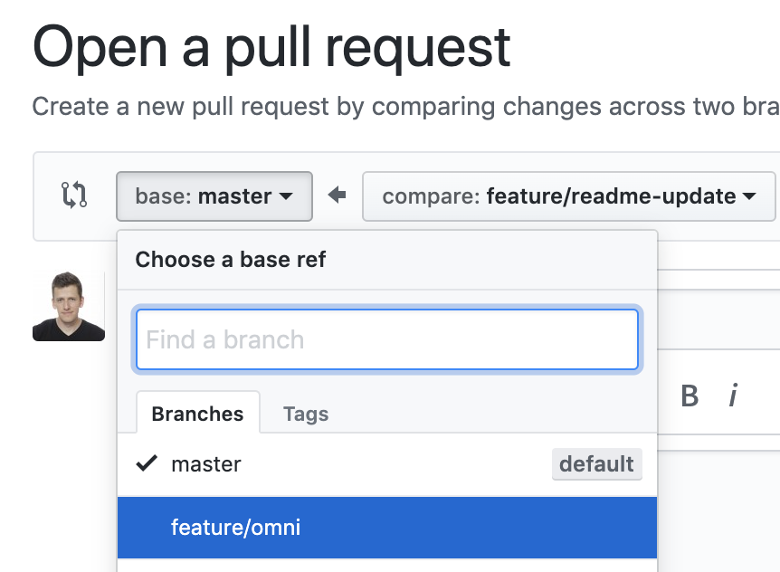

# Developer Docs

[Docs](https://smartsupp.github.io/docs/) for **Smartsupp** chat box. 

## Run Docs

1. Clone repo.
2. Select and pull [feature/omni](https://github.com/smartsupp/smartsupp.github.io/tree/feature/omni) branch.
3. Run Docs via Docker. 

### Docker

- start: `make up`
- stop: `make down`

Localhost: <http://0.0.0.0:4002/docs/>

## Contributing

1. Clone repo if you did not do it yet.
2. Select `feature/omni` branch.
3. Create new branch => `git checkout -b feature/name-you-choose`.
4. Update content in your branch.
5. Stage, commit and push changes to GitHub.
6. Create pull request from **your branch**.
7. Select `feature/omni` as branch you want to merge into.

## Deployment

Docs deploy to production on *GitHub Pages* automatically each time `master` branch is updated.

## License

See the [LICENSE](LICENSE.md) file for license rights and limitations (MIT).

## Copyright

Copyright (c) 2020 [smartsupp.com](https://www.smartsupp.com/)
